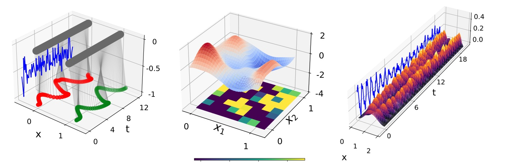

# Code repository for "Half-Inverse Gradients for Physical Deep Learning" 
This repository contains the source code for the ICLR'22 paper on ["Half-Inverse Gradients for Physical Deep Learning"](https://arxiv.org/pdf/2203.10131.pdf) by [Patrick Schnell](https://ge.in.tum.de/about/patrick-schnell/), [Philipp Holl](https://ge.in.tum.de/about/philipp-holl/) and [Nils Thuerey](https://ge.in.tum.de/about/n-thuerey/) from the [Physics-based Simulation Group, Technical University of Munich](https://ge.in.tum.de/).



## Abstract:

Recent works in deep learning have shown that integrating differentiable physics simulators into the training process can greatly improv e the quality of results. Although this combination represents a more complex optimization task than supervised neural network training, the same gradient-based optimizers are typically employed to minimize the loss function. However, the integrated physics solvers have a profound effect on the gradient flow as manipulating scales in magnitude and direction is an inherent property of many physical processes. Consequently, the gradient flow is often highly unbalanced and creates an environment in which existing gradient-based optimizers perform poorly. In this work, we analyze the characteristics of both physical and neural network optimizations to derive a new method that does not suffer from this phenomenon. Our method is based on a half-inversion of the Jacobian and combines principles of both classical network and physics optimizers to solve the combined optimization task. Compared to state-of-the-art neural network optimizers, our method converges more quickly and yields better solutions, which we demonstrate on three complex learning problems involving nonlinear oscillators, the Schroedinger equation and the Poisson problem.

## Installation

We recommend to install the required python packages (see `hig_env.yaml`) via a conda environment (using [miniconda](https://docs.conda.io/en/latest/miniconda.html)).
```
conda env create -f hig_env.yaml 
conda activate hig_env
```
The Poisson Simulations were done with [PhiFlow](https://github.com/tum-pbs/PhiFlow), which can be installed with:
```
pip install phiflow dash
```

## Basic Usage

For each of the three physical systems considered in the paper, there is a folder containing the simulation files. In order to repeat experiments from the paper, several `submit_X.py` files are included with X being the name of the optimization method used for network training. For instance, to reproduce the HIG curve in figure 2b, run `Nonlinear_Oscillators/submit_HIG.py`.
The results are saved as `.pickle` files and can be plotted by using `plot.py`.

For the Poisson Problem, PhiFlow saves the results in `home/user/phi/`. The Pretraining-Experiments can be reproduced by saving the model using the `save_model` command during the simulation and restarting the simulation with the `net.load_weights` function included.


